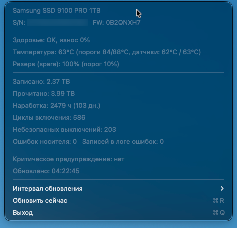

<div align="center">

# 🧊 SSDMonitor

### SMART-телеметрия Samsung NVMe прямо в строке меню macOS

[](#требования)
[](#сборка-и-запуск)
[](#почему-это-вообще-работает)
[](#требования)
[](LICENSE)

[English](README.md) · **Русский**

<br>



</div>

<br>

Виджет в строке меню macOS для мониторинга Samsung SSD 9100 PRO (или любого другого NVMe-накопителя), подключённого через **Thunderbolt/USB4-кейс**. Показывает температуру, износ, TBW и остальную SMART-телеметрию — то, что не даёт увидеть Samsung Magician (у него вообще нет версии под macOS, а Windows-версия не видит диски за USB/TB-мостами).

> [!NOTE]
> Интерфейс подстраивается под язык системы: русский, если он основной в macOS, английский во всех остальных случаях. Подробнее — [Язык интерфейса](#язык-интерфейса).

---

## Почему это вообще работает

Samsung Magician и большинство SMART-тулов не видят диск во внешнем кейсе, потому что типичный USB-кейс — это **мост USB→NVMe с трансляцией протокола** (чипы JMicron/ASMedia/Realtek), который часто не пробрасывает наружу низкоуровневые NVMe-команды.

Кейс, для которого писался этот виджет, подключён как **Thunderbolt/USB4 (40 Гбит/с)** и **туннелирует настоящий PCIe** — macOS видит диск как обычный `Protocol: PCI-Express` NVMe-девайс (`system_profiler SPNVMeDataType`), без трансляции. Поэтому `smartctl` читает полный SMART/Health Log без всяких обходов и **без sudo**.

Если ваш кейс — обычный USB-SATA/USB-NVMe мост (не Thunderbolt/USB4), скорее всего ничего не заработает: `smartctl --scan-open` просто не покажет устройство или покажет его без доступа к SMART-логам.

## Что показывает

- Модель, серийный номер, версия прошивки
- Здоровье / износ (`percentage_used`, порог `available_spare`)
- Температура (текущая + оба сенсора + пороги warning/critical), подсветка иконки оранжевым/красным при приближении к порогам
- Записано / прочитано в TB (пересчитано из `data_units_*` по спеке NVMe: 1 unit = 512 000 байт)
- Наработка в часах и днях, число циклов включения, небезопасных выключений
- Ошибки носителя и записи в логе ошибок
- Критические предупреждения (`critical_warning` bitfield)
- Время последнего обновления

## Чего не может (и не будет) делать

Требует проприетарных vendor-specific NVMe-команд, которые знает только официальный драйвер Samsung — реверс-инжинирить их я не стал (риск окирпичить диск):

- Обновление прошивки
- Secure Erase
- Over-Provisioning
- RAPID mode
- Бенчмарк (в принципе можно добавить отдельно, это не протокольное ограничение — просто не сделано)

## Требования

- macOS 13+
- Swift toolchain (Xcode Command Line Tools)
- [smartmontools](https://www.smartmontools.org/) — `brew install smartmontools`
  - Бинарник ищется по путям `/opt/homebrew/bin/smartctl` и `/usr/local/bin/smartctl`

## Сборка и запуск

```bash
git clone https://github.com/RomusKras/SamsungSSDMonitor.git
cd SamsungSSDMonitor
swift build -c release
./.build/release/SSDMonitor        # запуск на переднем плане, для отладки
```

Виджет — accessory-приложение (`NSApp.setActivationPolicy(.accessory)`): иконки в Dock нет, только в строке меню.

## Автозапуск через LaunchAgent

Выполнить **из корня репозитория** — `$PWD` подставит путь к бинарнику за вас:

```bash
cat > ~/Library/LaunchAgents/com.romankrasovskij.ssdmonitor.plist <<PLIST
<?xml version="1.0" encoding="UTF-8"?>
<!DOCTYPE plist PUBLIC "-//Apple//DTD PLIST 1.0//EN" "http://www.apple.com/DTDs/PropertyList-1.0.dtd">
<plist version="1.0">
<dict>
    <key>Label</key>             <string>com.romankrasovskij.ssdmonitor</string>
    <key>ProgramArguments</key>  <array><string>$PWD/.build/release/SSDMonitor</string></array>
    <key>RunAtLoad</key>         <true/>
    <key>ProcessType</key>       <string>Interactive</string>
    <key>KeepAlive</key>         <dict><key>SuccessfulExit</key><false/></dict>
    <key>StandardOutPath</key>   <string>/tmp/ssdmonitor.out.log</string>
    <key>StandardErrorPath</key> <string>/tmp/ssdmonitor.err.log</string>
</dict>
</plist>
PLIST
```

`KeepAlive.SuccessfulExit = false` — перезапуск при падении, но не после того, как вы сами вышли через меню.

```bash
# загрузить/включить автозапуск
launchctl bootstrap gui/$(id -u) ~/Library/LaunchAgents/com.romankrasovskij.ssdmonitor.plist

# перезапустить после пересборки (kill + restart одной командой)
launchctl kickstart -k gui/$(id -u)/com.romankrasovskij.ssdmonitor

# проверить статус (state = running / not running, PID и т.п.)
launchctl print gui/$(id -u)/com.romankrasovskij.ssdmonitor

# полностью выгрузить (отключить автозапуск)
launchctl bootout gui/$(id -u)/com.romankrasovskij.ssdmonitor
```

Логи демона: `/tmp/ssdmonitor.out.log`, `/tmp/ssdmonitor.err.log`.

> [!IMPORTANT]
> После `swift build` бинарник просто перезаписывается по тому же пути — LaunchAgent подхватит новую версию только через `kickstart -k` (или логаут/релогин), сам он не перезапускается при изменении файла.

### Обновление кода — стандартный цикл

```bash
# отредактировать Sources/SSDMonitor/main.swift (или Localization.swift — тексты)
swift build -c release
launchctl kickstart -k gui/$(id -u)/com.romankrasovskij.ssdmonitor
```

## Настройка интервала обновления

Прямо в меню виджета: **«Интервал обновления»** → 10 сек / 30 сек / 1 мин / 2 мин / 5 мин, текущий вариант отмечен галочкой. Выбор:

1. сразу перезапускает внутренний таймер,
2. сразу запускает `refresh()`,
3. сохраняется в `UserDefaults` и переживает перезапуск — домен процесса, бинарник без bundle id, поэтому это **НЕ** `com.romankrasovskij.ssdmonitor` (см. «Известные особенности» ниже).

По умолчанию — 30 секунд, пока пользователь ни разу не менял настройку через меню.

```bash
# посмотреть сохранённый интервал (в секундах), если он уже выставлялся
defaults read SSDMonitor refreshInterval

# сбросить на дефолт (30 сек)
defaults delete SSDMonitor refreshInterval
```

## Язык интерфейса

Определяется автоматически при запуске по `Locale.preferredLanguages` — **русский**, если это ваш основной язык системы, **английский** во всех остальных случаях. Настройки для переключения нет: поменяйте порядок языков в *Системных настройках → Основные → Язык и регион* и перезапустите виджет.

Бинарник несбандленный, `.lproj` для `NSLocalizedString` взять неоткуда, поэтому обе локали лежат в [Localization.swift](Sources/SSDMonitor/Localization.swift) обычной таблицей строк. Добавить третий язык — это одна ветка там же, остальной код про локали ничего не знает.

## Автообнаружение диска

Путь `IOService:...` к NVMe-контроллеру **не хардкодится** и не кешируется между обновлениями — при каждом тике таймера заново вызывается `smartctl --scan-open -j`, перебираются все найденные NVMe-устройства, и берётся первое, чей `model_name` содержит `samsung` (без учёта регистра). Это значит:

- unplug/replug кейса подхватывается автоматически, без перезапуска виджета;
- если к Маку одновременно подключено несколько Samsung NVMe (например, встроенный SSD Samsung + внешний), возьмётся первый найденный по порядку сканирования — не гарантированно тот, что нужен. Если у вас такая конфигурация, надо будет захардкодить конкретный путь или фильтровать по серийнику в `Smartctl.findSamsungReport()` ([main.swift](Sources/SSDMonitor/main.swift)).

## Что будет, если выдернуть диск

Виджет это переживает без падения. Что именно происходит:

1. Каждый цикл обновления заново вызывает `smartctl --scan-open -j` — путь к устройству нигде не кешируется между тиками (см. [Автообнаружение диска](#автообнаружение-диска)). Если диск физически отключён, он просто пропадает из списка сканирования.
2. `findSamsungReport()` не находит модель с `samsung` в названии → `update(with: nil)` → `showError(...)`.
3. Иконка в строке меню меняется на предупреждающую (`externaldrive.trianglebadge.exclamationmark`), заголовок красным — **«нет диска»**, вместо температуры.
4. В меню остаётся строка **«Последний раз виден: HH:MM:SS»** — время последнего успешного опроса, чтобы было понятно, что данные не просто зависли, а диска реально нет.
5. При повторном подключении следующий тик таймера (или ручной **«Обновить сейчас»**) сам подхватывает диск обратно — перезапускать виджет не нужно.

Защита от подвисания самого процесса `smartctl` (на случай отключения ровно посреди NVMe-команды):

- у каждого вызова `smartctl` есть watchdog-таймаут 5 сек (`Smartctl.run(timeout:)`) — если процесс не завершился, он принудительно убивается (`process.terminate()`), и refresh откатывается на «не найден» вместо зависания навсегда;
- `refresh()` игнорирует новый тик таймера, если предыдущий цикл ещё не завершился (`isRefreshing`-флаг) — исключает накопление зависших фоновых процессов `smartctl`, даже если что-то пошло не так несколько тиков подряд.

> [!WARNING]
> **Что НЕ тестировалось физически:** реальное выдёргивание кабеля посреди передачи NVMe-команды. Логика симулировалась через заведомо несуществующий путь `IOService:...` (`smartctl` в этом случае фейлится мгновенно, ~0.03 сек, отдаёт `exit_status: 2` с сообщением `No such file or directory`) — этого достаточно для штатного unplug/переподключения, но не является 100% гарантией для экзотичных гонок на уровне драйвера кейса. Физически дёргать боевой диск не стал: на нём смонтирован рабочий каталог этого же проекта (`/Volumes/Samsung9100Pro/...`), обрыв уронил бы открытые в IDE файлы и текущую shell-сессию.

<details>
<summary><b>Диагностика вручную</b></summary>

<br>

```bash
# список всех видимых NVMe-контроллеров
smartctl --scan-open --json

# полный SMART-дамп конкретного устройства (путь из --scan-open)
smartctl -a -j "IOService:/...путь.../IONVMeBlockStorageDevice@1" -d nvme

# быстрая проверка на уровне macOS без smartctl вообще
system_profiler SPNVMeDataType

# убедиться, что кейс туннелирует PCIe, а не транслирует протокол
system_profiler SPThunderboltDataType
diskutil info diskN | grep Protocol   # должно быть "PCI-Express", не "USB"
```

Если `smartctl --scan-open` не находит внешний диск — дело не в этом виджете, а в кейсе/подключении (см. [Почему это вообще работает](#почему-это-вообще-работает)).

</details>

<details>
<summary><b>Известные особенности / грабли</b></summary>

<br>

- **Без sudo не запускается только если** конкретная связка кейс+чип этого требует — для Thunderbolt/USB4-туннеля обычно не требуется (проверено).
- Приложение **не подписано и не в App Translocation** — Gatekeeper не должен ругаться, т.к. бинарник собран локально, а не скачан.
- `UserDefaults.standard` у несбандленного бинарника пишет в `~/Library/Preferences/SSDMonitor.plist` (по имени процесса), а не по reverse-DNS id из `Package.swift`/LaunchAgent-label — не путать при отладке через `defaults read`.
- Статус-бар айтем при автоматизации через некоторые Accessibility-инструменты может определяться системой как принадлежащий «Пункт управления» — на обычный клик мышью в реальной сессии это не влияет, проявляется только при программном UI-driven тестировании неподписанных процессов.

</details>

## Лицензия

[MIT](LICENSE) — делайте что угодно, достаточно сохранить копирайт.
